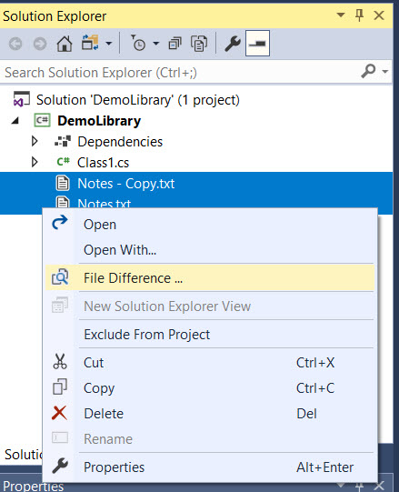
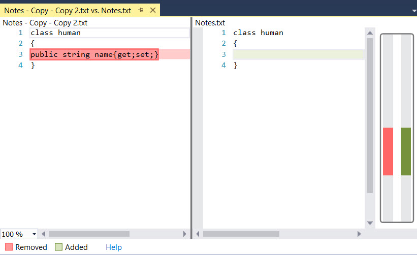

# Compare Tool

<!-- Replace this badge with your own-->

<!-- Update the VS Gallery link after you upload the VSIX-->
Download this extension from the [VS Gallery](https://visualstudiogallery.msdn.microsoft.com/[GuidFromGallery])
or get the [CI build](http://vsixgallery.com/extension/9616-fc80-41f8-a5e7-1e47bf5dfb78/).

---------------------------------------

compare files as source control comapre tool

See the [change log](CHANGELOG.md) for changes and road map.

## Features

- Compare Two Files in Solution Explorer

### Files Comapre
-Select two files in solution explorer
-then Right-Click  

- then select "Comapre Files ..."  to see the Diff View

## Contribute
Check out the [contribution guidelines](CONTRIBUTING.md)
if you want to contribute to this project.

For cloning and building this project yourself, make sure
to install the
[Extensibility Tools 2015](https://visualstudiogallery.msdn.microsoft.com/ab39a092-1343-46e2-b0f1-6a3f91155aa6)
extension for Visual Studio which enables some features
used by this project.

## License
[Apache 2.0](LICENSE)